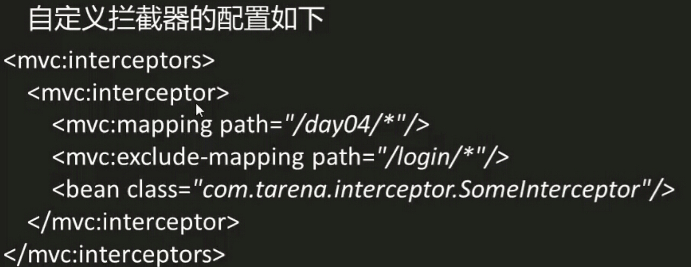

  
## 什么是拦截器
spring提供一个特殊的组件，当dispatcherServlet收到请求之后，如果有拦截器，会先调用拦截器，然后调用相应的处理器(Controller).
##### 注意：
过滤器属于servlet规范，而拦截器属于spring框架 
## 如何写一个拦截器 
1. 写一个java类，实现HandlerInterceptor接口
2. 实现具体的拦截处理逻辑，比如，session验证。
3. 配置拦截器
  **注意：** 拦截器地址     1. /**表示拦截所有请求地址。     2. /*仅表示拦截该层的所有请求地址。 
## 代码演示
```  
import javax.servlet.http.HttpServletRequest;  
import javax.servlet.http.HttpServletResponse;     
import org.springframework.web.servlet.HandlerInterceptor;  
import org.springframework.web.servlet.ModelAndView;     
public class SpringMVCInterceptor implements HandlerInterceptor {             /**       * preHandle方法是进行处理器拦截用的，顾名思义，该方法将在Controller处理之前进行调用，SpringMVC中的Interceptor拦截器是链式的，可以同时存在       * 多个Interceptor，然后SpringMVC会根据声明的前后顺序一个接一个的执行，而且所有的Interceptor中的preHandle方法都会在       * Controller方法调用之前调用。SpringMVC的这种Interceptor链式结构也是可以进行中断的，这种中断方式是令preHandle的返       * 回值为false，当preHandle的返回值为false的时候整个请求就结束了。       */       @Override       public boolean preHandle(HttpServletRequest request,               HttpServletResponse response, Object handler) throws Exception {           // TODO Auto-generated method stub           return false;       }              /**       * 这个方法只会在当前这个Interceptor的preHandle方法返回值为true的时候才会执行。postHandle是进行处理器拦截用的，它的执行时间是在处理器进行处理之       * 后，也就是在Controller的方法调用之后执行，但是它会在DispatcherServlet进行视图的渲染之前执行，也就是说在这个方法中你可以对ModelAndView进行操       * 作。这个方法的链式结构跟正常访问的方向是相反的，也就是说先声明的Interceptor拦截器该方法反而会后调用，这跟Struts2里面的拦截器的执行过程有点像，       * 只是Struts2里面的intercept方法中要手动的调用ActionInvocation的invoke方法，Struts2中调用ActionInvocation的invoke方法就是调用下一个Interceptor       * 或者是调用action，然后要在Interceptor之前调用的内容都写在调用invoke之前，要在Interceptor之后调用的内容都写在调用invoke方法之后。       */       @Override       public void postHandle(HttpServletRequest request,               HttpServletResponse response, Object handler,               ModelAndView modelAndView) throws Exception {           // TODO Auto-generated method stub                  }          /**       * 该方法也是需要当前对应的Interceptor的preHandle方法的返回值为true时才会执行。该方法将在整个请求完成之后，也就是DispatcherServlet渲染了视图执行，       * ex:是处理器所抛出的异常，可以写一个拦截器用来处理处理器所抛出的异常      */       @Override       public void afterCompletion(HttpServletRequest request,               HttpServletResponse response, Object handler, Exception ex)       throws Exception {           // TODO Auto-generated method stub                  }         
}    ```
